# Philbin

**Alert**: This is [buggy](#bugs) and [insecure software](#security-concerns)! Do not [use](#how-to-use)!

Philbin uses an LLM to generate descriptions and regular expressions for data selections.

This is inspired by Geoffrey Litt showing me a demo of [Potluck](https://www.inkandswitch.com/potluck/) by Litt, Schoening, Shen, and Sonnentag. I'm a big fan of what they call _gradual enrichment_ media: spreadsheets and HTML/CSS/JavaScript also have this property.

However, I disliked one aspect of Potluck: it asks you to author regular expressions. Regular expressions are an abstract entity (a program). People need help getting from the concrete to the abstract. Even if Potluck incorporates a bunch of clever regexps, people still need help getting there.

What I'd rather have is a UX where I select/swipe/… across a bunch of concrete data, and ask a system to suggest the abstraction for me. That helps me get off the ground. From there, I can correct, refine, augment, and otherwise play with the code. One could even imagine using a counter-example—based interactive synthesis tool to generate the right code.

Of course, we don't want to have to select too precisely. We want to do it quickly and casually and still get pretty good results.

## Demo

https://github.com/shriram/philbin/assets/75030/cd6f47c0-4f34-49af-85b8-18311d200955

## Examples

### File: [`db1.txt`](db1.txt). gpt-3.5-turbo, default temperature. 

A good inference (note that `m` is ambiguous: "miles", "meters", or something else?):

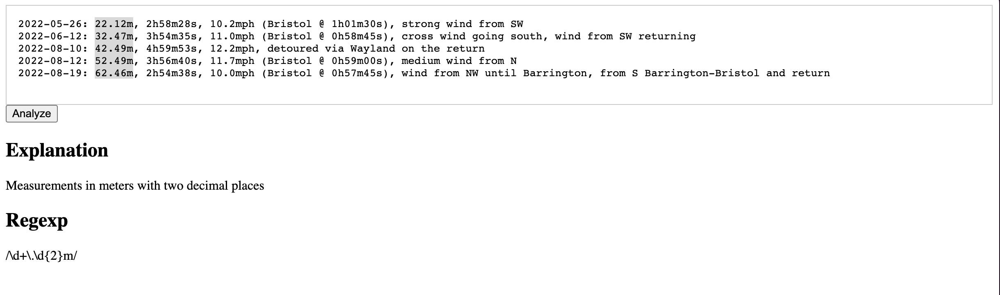

A weak inference:

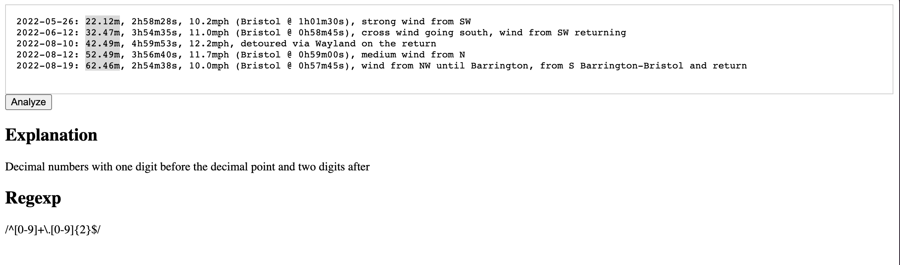

A good inference (try several of this selection, you'll get interesting results):

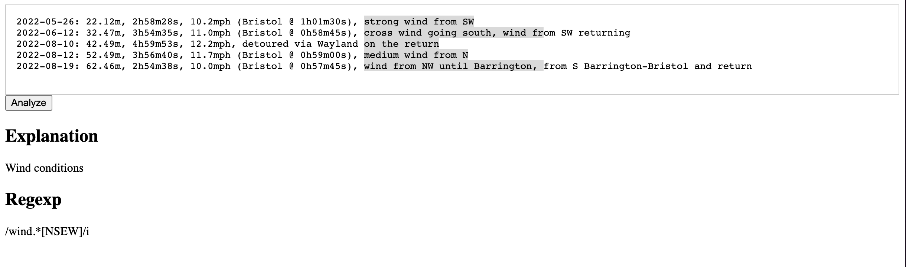

Another good inference, but difficult to turn into a meaningful regexp since it requires knowledge of place names:

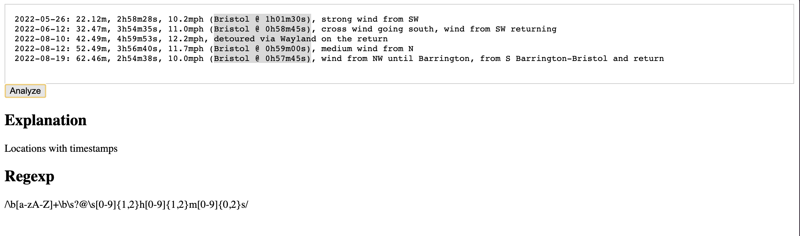

### File: [`db2.txt`](db2.txt). gpt-3.5-turbo, default temperature. 

Clean, basic inference, but too specific due to the selection:

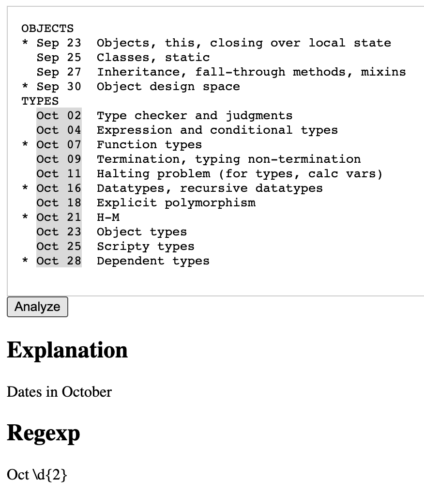

This selection doesn't always do the trick, but sometimes the LLM does nail it!

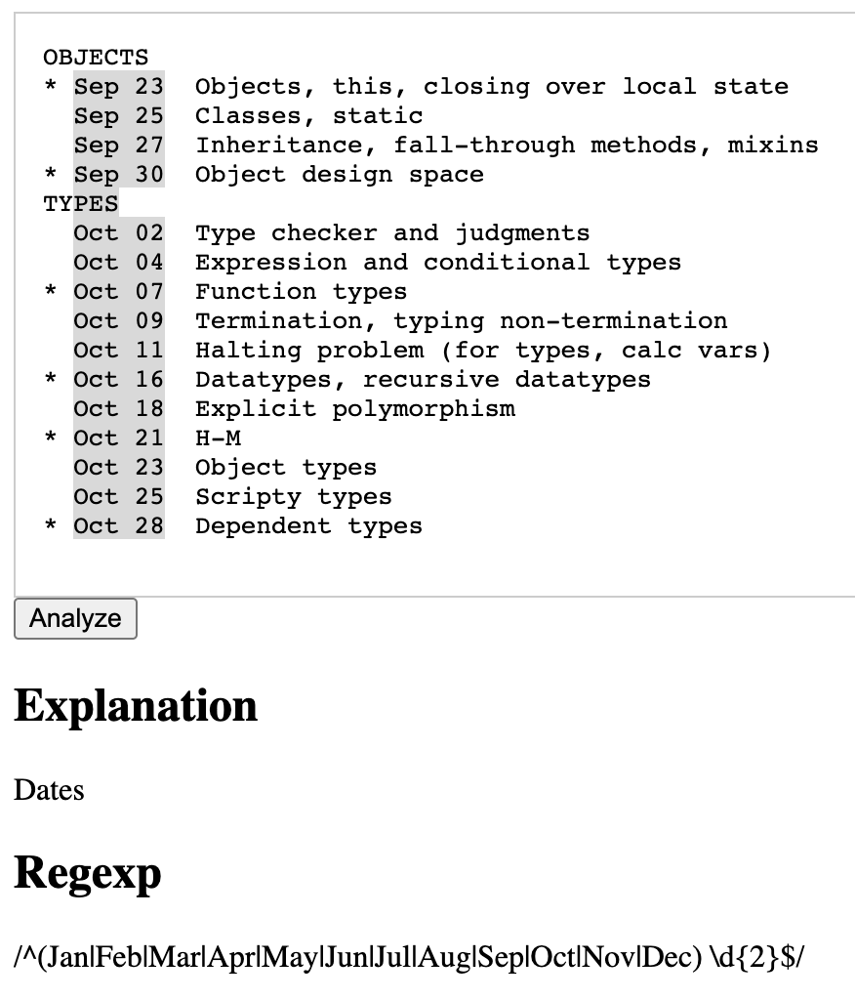

Why stop with structured data?

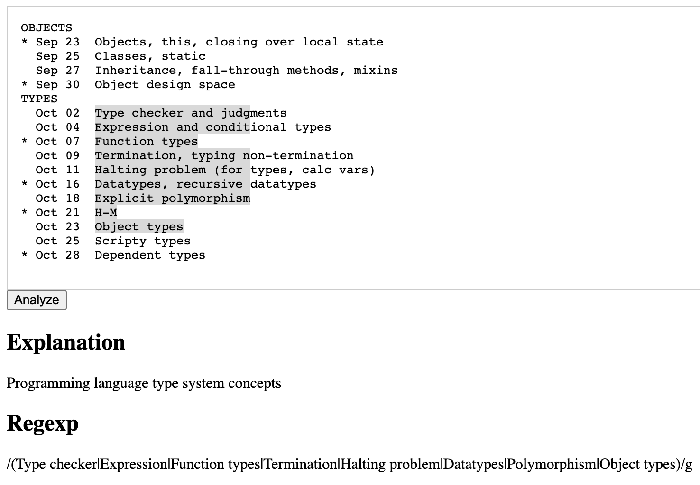

### File: [`db3.txt`](db3.txt). gpt-3.5-turbo, default temperature. 

This is meant to simulate a rough selection, e.g., by loosely tracing a finger. Since we're using rectangular selection in the buffer, we'll shift around the data to simulate it.

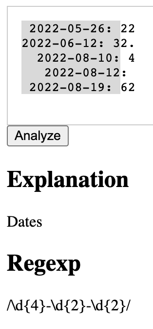

### File: [`db4.txt`](db4.txt). gpt-3.5-turbo, default temperature.

Now we can really exploit the *language* part of an LLM, at least for well-known languages. Good luck with regular expressions, though!

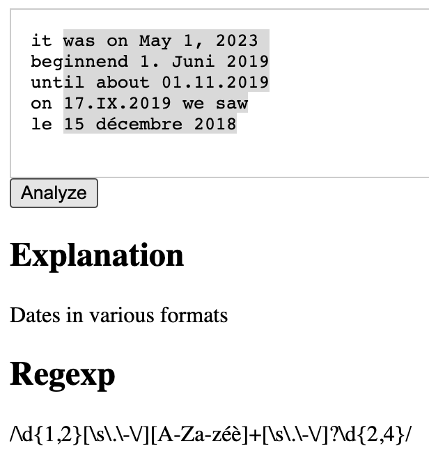

### File: [`db5.txt`](db5.txt). gpt-3.5-turbo, default temperature.

We've got to do an example from Geoffrey's beloved domain, recipes.

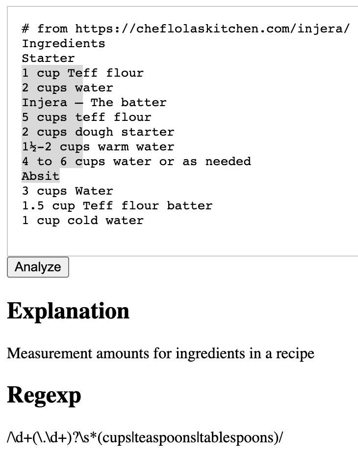

Oh, that's quite specific:

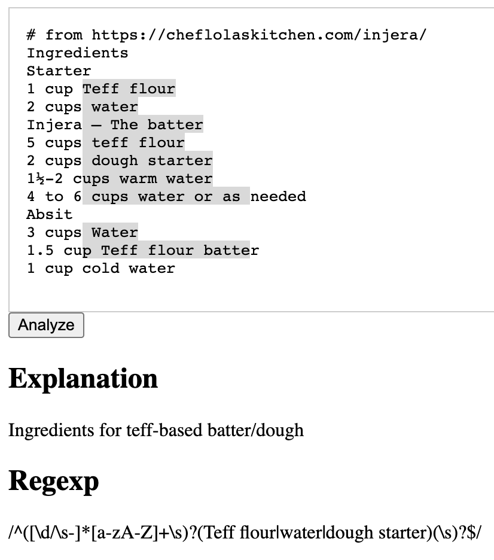

## Bugs

Quotation is a nightmare. We ask the LLM to respond with a JSON object that contains the textual description and the regexp. We ask it return a *quoted* regexp, but sometimes it runs afoul of the JSON parser. If the system appears to have hung, there's a good chance the response was not quoted properly. Look in the JavaScript console: you may see a report like `Uncaught (in promise) SyntaxError: Bad escaped character in JSON`. A solution would be to avoid JSON entirely and instead use the chat interface to make two requests that each produce one component.

## Security Concerns

There are at least two known issues.

1. I didn't want the bother of setting up a server to route messages. Therefore, this personal prototype embeds the OpenAI API key right in the Web page. You should **never** do this! Anyone can read the page source, copy the key, use it themselves, and bankrupt you.

  One could, of course, try various protection methods. For instance, one could probably use GitHub actions to prevent pushing certain commits. But:
  
  (a) That may not work across other platforms.
  
  (b) You may have committed the key, then be blocked from pushing, at which point you remove the key…but it's still in earlier commits. After all, adding the key is probably the first thing you'll do, because otherwise this is unusable.
  
  So, I didn't want to create a false sense of security. Just don't use this code and you'll be fine. (-:
  
2. The output from the LLM is embedded into the Web page. This needs to be sanitized and quoted in all kinds of ways that I couldn't be bothered to figure out. But it means the response could contain malicious code that could, for instance, launch an [XSS](https://owasp.org/www-community/attacks/xss/) attack.

Therefore, if you use this code, which you shouldn't, you undertake that you're responsible for any consequences resulting from the above.

## How to Use

1. Read the [security alert](security-concerns). Do not use.
2. If you decide to use it anyway, edit `index.html` to replace `OPENAI_API_KEY` with your OpenAI API key. Note that there are no quotes or anything else around it.
3. Paste your dataset into the editor. Select. Click.
4. Sometimes OpenAI is not very responsive. Sorry. Reload and try again.
5. Because the LLM's response is not deterministic, sometimes you will get different results from trying the same query multiple times.

## Philbin?!?

Repositories need names. I was thinking about regular expressions, aka, "regexp". That sounded a bit like "Regis". As in [Regis Philbin](https://en.wikipedia.org/wiki/Regis_Philbin). Because, you know, it fills in executable code or something. It's dumb.
